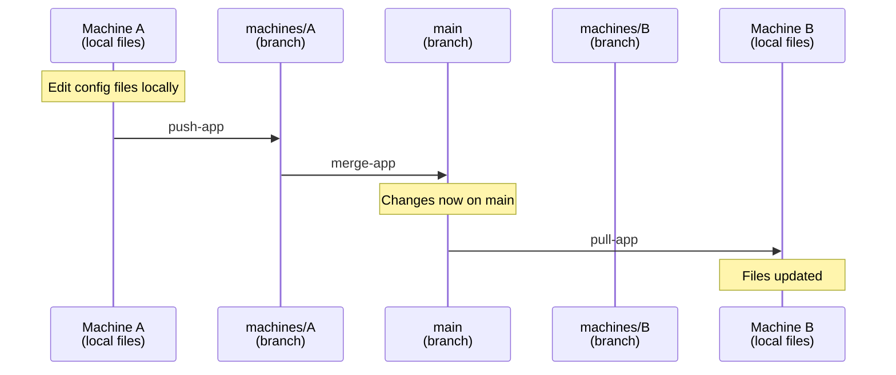
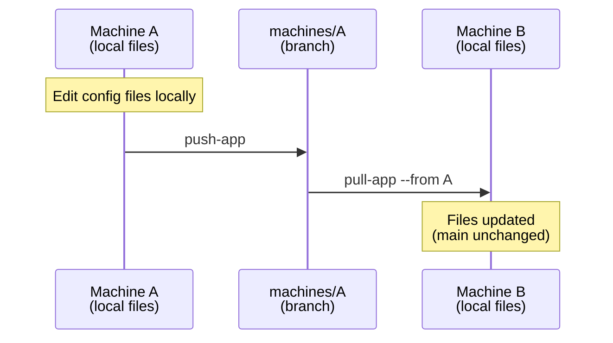
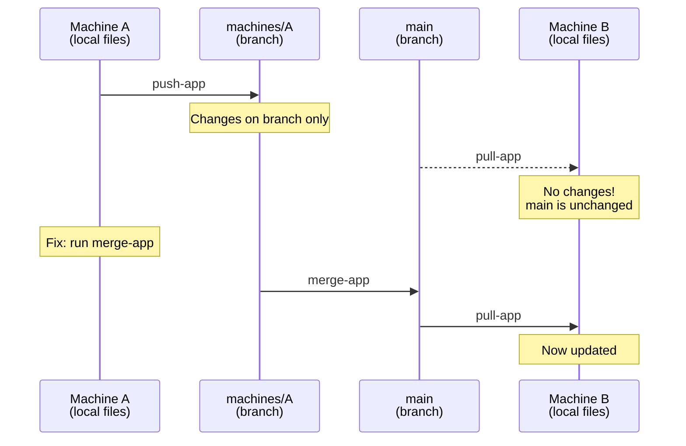
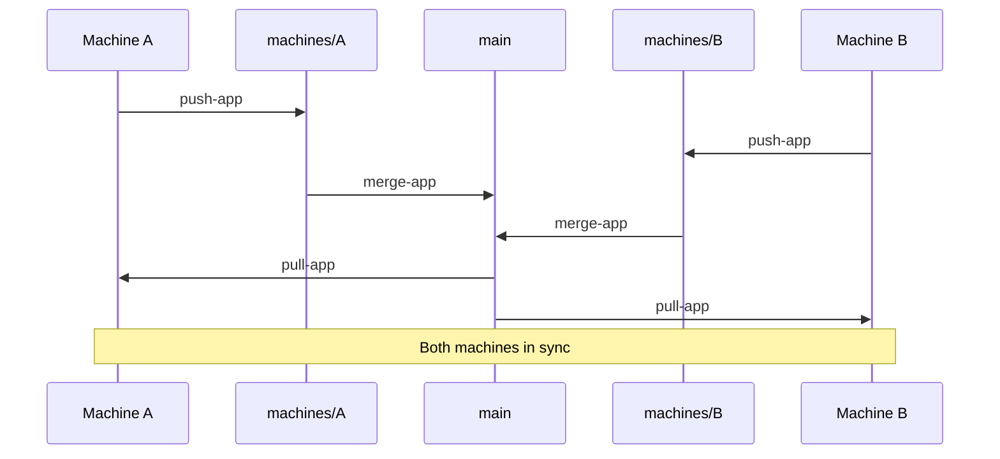

# Drifters Documentation

Complete documentation for Drifters config synchronization.

## Getting Started

- **[Quick Start Guide](QUICK_START.md)** - Get running in 5 minutes
- **[Main README](../README.md)** - Feature overview and comparison

## Configuration

- **[Editing Sync Rules](EDITING_SYNC_RULES.md)** - How to manually edit sync-rules.toml and add app definitions
- **[Import & Export](IMPORT_EXPORT.md)** - Import/export app definitions and rules
- **[App Presets](../presets/)** - Pre-configured definitions for popular apps

## Core Concepts

### Sync Rules Hierarchy

Rules are applied in order (highest priority first):

1. **Machine-specific** (`[apps.app.machines.laptop]`)
2. **OS-specific** (`include-macos`, `include-linux`)
3. **App defaults** (`[apps.app]`)

### Section Tags

Exclude machine-specific content within files:

```bash
# ~/.zshrc
export SHARED_VAR="value"

# drifters::exclude::start
export LOCAL_PATH="/home/user/specific/path"
# drifters::exclude::stop
```

### Branch-per-machine Merging

Each machine has its own git branch (`machines/<machine_id>`):
1. `push-app` pushes to your machine's branch
2. `merge-app` merges your branch into main (or selectively per app)
3. `pull-app` pulls from main (or `--from <machine>`)
4. Local exclude sections are always preserved

### Sync Scenarios

#### Standard sync via main

The normal workflow: push your changes, merge to main, other machines pull from main.



#### Direct machine-to-machine pull

Skip main and pull directly from another machine's branch. Useful for testing changes before merging.



#### Common mistake: forgetting merge-app

`push-app` only writes to your machine's branch — not to main. Without `merge-app`, other machines won't see your changes via `pull-app`.



#### Bidirectional sync between two machines

Both machines push their changes, merge to main, then pull the other's updates.



## Workflows

### Adding Apps

**Interactive:**
```bash
drifters add-app zed
# Follow prompts
```

**From preset (recommended):**
```bash
drifters load-preset zed
drifters merge-app zed
```

**Manual:**
```bash
# Edit sync-rules.toml directly
drifters edit-rules
```

See: [Editing Sync Rules](EDITING_SYNC_RULES.md)

### Syncing Across Machines

**Push local changes:**
```bash
drifters push-app [app]    # Push to your machine's branch
```

**Pull remote changes:**
```bash
drifters pull-app [app]              # Pull from main
drifters pull-app [app] --from mac01 # Pull from a specific machine
drifters pull-app [app] --dry-run    # Preview changes without applying
```

**Compare changes:**
```bash
drifters diff-app [app]              # Show diff in terminal
drifters diff-app [app] --tool       # Open diffs in external difftool
drifters diff-app [app] --against m2 # Compare against a specific branch
```

**Check status:**
```bash
drifters status            # See what's synced/changed
drifters list-app          # List all apps
```

### Merging to Main

After pushing to your machine branch:

```bash
drifters merge-app --dry-run              # Preview full merge
drifters merge-app                        # Merge all apps (full git merge)
drifters merge-app zed                    # Merge only zed (selective)
drifters merge-app --from mac01           # Merge another machine's branch
```

### Editing App Config Files

```bash
drifters edit-app-files zed    # Pick from zed's config files and open in editor
```

## Common Patterns

### Multi-Platform Config

```toml
[apps.zed]
include = ["~/.config/zed/settings.json"]

include-macos = ["~/Library/Application Support/Zed/settings.json"]
include-linux = ["~/.config/zed/settings.json"]
include-windows = ["~/AppData/Roaming/Zed/settings.json"]
```

### Per-Machine Exceptions

```toml
[apps.zed]
include = ["~/.config/zed/**/*.json"]

[apps.zed.machines.laptop]
exclude = ["**/keymap.json"]  # Different keyboard
```

### Glob Patterns

```toml
include = [
    "~/.config/app/**/*.json",     # All JSON files recursively
    "~/.config/app/*.conf",         # Conf files in root only
]

exclude = [
    "~/.config/app/cache/**",       # Entire directory
    "**/temp-*.json",               # Pattern anywhere
]
```

### Section Tag Usage

In config files:

```json
// JSON: //
// drifters::exclude::start
{ "local": "value" }
// drifters::exclude::stop
```

```yaml
# YAML: #
# drifters::exclude::start
local_setting: value
# drifters::exclude::stop
```

```lua
-- Lua: --
-- drifters::exclude::start
local config = {}
-- drifters::exclude::stop
```

```vim
" Vim: "
" drifters::exclude::start
set local_option
" drifters::exclude::stop
```

## Architecture

### Repository Structure

Each machine has its own branch (`machines/<machine_id>`). On each branch:

```
machines/mac01 branch:
├── .drifters/
│   ├── sync-rules.toml    # Central configuration (on main)
│   └── machines.toml      # Machine registry (on main)
└── apps/
    └── zed/
        ├── settings.json
        └── keymap.json
```

`main` contains the merged state after running `merge-app`.

### Ephemeral Strategy

Every command:
1. Clones repo to temp location
2. Performs operation
3. Commits and pushes
4. Deletes temp repo

Benefits: Always fresh, no stale state.

### Local Storage

```
~/.config/drifters/
├── drifters.toml        # Machine ID, repo URL, editor, update settings
└── tmp-repo/            # Temporary (deleted after each command)
```

## Advanced Topics

### Multiple Exclude Sections

You can have multiple exclude sections per file:

```bash
export SHARED1="value"

# drifters::exclude::start
export LOCAL1="path"
# drifters::exclude::stop

export SHARED2="value"

# drifters::exclude::start
export LOCAL2="path"
# drifters::exclude::stop
```

### External Difftool

`diff-app --tool` opens each changed file in your configured `git difftool`. Configure one globally:

```bash
# Zed
git config --global diff.tool zed
git config --global difftool.zed.cmd 'zed --wait --diff "$LOCAL" "$REMOTE"'

# Sublime Merge
git config --global diff.tool smerge

# VS Code
git config --global diff.tool vscode
```

For conflict resolution during `merge-app`, also set a mergetool:

```bash
git config --global merge.tool smerge
```

### Debugging

```bash
# Verbose output
drifters -v push-app

# Check what's tracked
drifters list-app

# See status
drifters status

# Preview pull changes
drifters pull-app --dry-run

# Preview merge
drifters merge-app --dry-run
```

## Troubleshooting

See [Quick Start - Troubleshooting](QUICK_START.md#troubleshooting)

Common issues:
- **Authentication errors** - Check SSH setup
- **Repo already exists** - Clear temp: `rm -rf ~/.config/drifters/tmp-repo`
- **Changes not syncing** - Run `drifters merge-app` to merge your branch into main
- **Syntax errors** - Validate TOML syntax

## Contributing

See [CONTRIBUTING.md](../CONTRIBUTING.md) for:
- Adding app presets
- Submitting bug reports
- Contributing code

## Examples

- [Zed preset](../presets/zed.toml)
- [VS Code preset](../presets/vscode.toml)

## Future Plans

Planned features:
- Community preset registry
- TUI diff viewer with syntax highlighting
- Improved conflict resolution UI
- Config validation and linting

## Getting Help

- **Issues:** [GitHub Issues](https://github.com/tjirsch/drifters/issues)
- **Questions:** [GitHub Discussions](https://github.com/tjirsch/drifters/discussions)
- **Contributing:** [CONTRIBUTING.md](../CONTRIBUTING.md)
